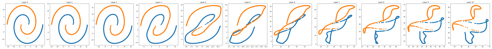
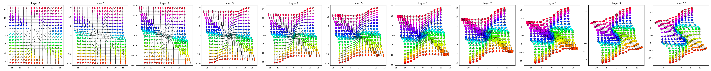
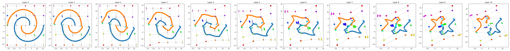

# Understanding "Principles of Riemannian Geometry in Neural Networks" by Michael Hauser and Asok Ray
This project serves as a playground for experiments inspired by the paper 
[Principles of Riemanian Geometry in Neural Networks](https://papers.nips.cc/paper/6873-principles-of-riemannian-geometry-in-neural-networks).
## Main ideas
The experimental setup consists of training a deep neural network with two neurons per layer to separate two classes of 
data points. Plotting each data point's activations on a 2d scatter plot on every layer helps to gain an understanding 
of how the data transforms geometrically as it passes through the network. Furthermore, it enables the interpretation of 
NNs as sequential coordinate transformations, which means that the activation of a single neuron is one coordinate of 
the respective layer's coordinate system.

An example of this idea can be seen in the following image. The network is a C2-differentiable network as described in 
the paper, but with the sigmoid activation in the hidden units.

Assuming the output space of a neural network is endowed with a euclidean metric (and assuming some additional technical 
details), the metric tensor from the last layer can be 
[pulled back](https://en.wikipedia.org/wiki/Pullback_(differential_geometry\)) through the layers to the input space by

}{b_{(l)}}}=\overset{\curvearrowleft}{\prod_{l'=L-1}^{l}}\left[J{^{a_{(l+1)}}_{\quad\quad a_{(l)}}}J{^{b_{(l+1)}}_{\quad\quad b_{(l)}}}\right]\eta_{a_{(L)}{b_{(L)}})

with the jakobian

}}_{\quad\quad a_{(l)}}}=\frac{\partial x^{a_{(l+1)}}}{\partial x^{a_{(l)}}} ) 

written in tensor notation. This ultimately introduces one possible way of measuring distances between data points in 
the input space.

In the following, the euclidean metric is pulled back from the last layer to the first and the metric tensors are visualized using their 
principal components to draw ellipses.

